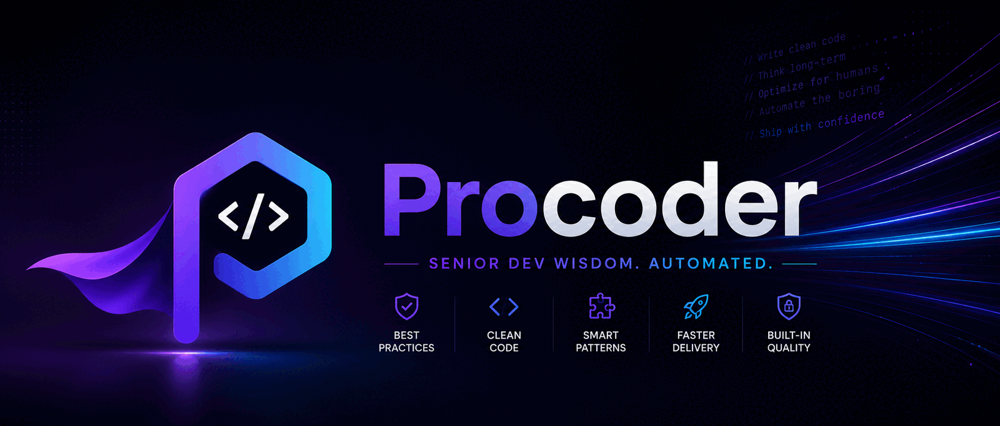

<p align="center">
  
</p>

**Make your AI coder work like a senior developer.** One Go binary gives
the agent a commit gate it cannot talk its way past, quality controllers
that refuse to call unfinished work done, and a self-learning loop that
turns every escaped bug into a permanently closed class. The agent stays
in control — nothing ever touches your code behind its back.


## Quick start

```
/plugin marketplace add azrtydxb/procoder
/plugin install procoder
/procoder:init          # installs the tools this repository needs
```

That's Claude Code; Procoder also ships adapters for **every agent** —
Cursor, Windsurf, Cline, Kilo Code, Roo, Kiro, Codex CLI, Copilot CLI,
Gemini, OpenCode, and anything that reads `AGENTS.md`. See
[Every agent](https://procoder.azrty.com/portability/).

## Before / after

Without Procoder, "done" is whatever the agent last said. With it, done
has to survive the gate — this is a real run, verbatim, on a demo repo
with an unformatted file, a conflict marker, and a staged junk file:

```
$ procoder check
unformatted  main.go  (run `procoder format "main.go"` for the result)
BLOCKING     notes.md:1  merge conflict marker left in the file
BLOCKING     notes.md:5  merge conflict marker left in the file
BLOCKING     .DS_Store  junk file staged — caches and garbage never belong in a commit
...
procoder gate: 0 clean, 2 unformatted, 0 unchecked, 1 out of scope, 8 hygiene finding(s) (3 blocking)
```

The agent gets the findings and the fixed content in the same turn; the
binary never edits a file itself. And a tool that failed is **never**
reported as clean — "unchecked" counts as failing, said out loud.

## How it works

```
agent writes code ──► hook fires ──► binary computes findings
        ▲                                    │
        └──── agent reviews and implements ◄─┘
```

Two modes, one principle:

- **Self-serve** — tools the agent runs itself: check, format, lint,
  scan, query the index, audit the tree.
- **Forced** — hooks at fixed lifecycle points (every write, every
  session start) the agent cannot skip.
- **P-CONTROL** — the binary computes and reports; the agent acts.
  Nothing modifies code, files, or state behind the agent's back.

## What's inside

**The commit gate** (`procoder check`) — formatting across the popular
languages (Go, Python, JS/TS/HTML/CSS, PHP, Rust, C/C++, Java, Kotlin,
Swift, Ruby, Dart, C#, shell — one canonical formatter each, the
project's config always wins), git hygiene (conflict markers, junk, oversized
files, AI-attribution lines), secrets, lint, ci and infra hygiene, and
documentation health, all through one code path so `check`, `git`, and
CI can never disagree.

**The quality chain** — thinking before code, with a refusing controller
at every link: a **spec** interview closes design gaps before anything is
built (`spec check` blocks while sections are missing or questions
open), a **plan** turns the spec into tasks an engineer with zero
context could execute (`plan check` blocks placeholders), a **backlog**
holds larger projects as milestones → epics → user stories seeded from
specs and worked in scope-boxed **sprints** (one active sprint, explicit
carry-over, closes that refuse), and a **todo** list tracks standalone
work (`todo close` refuses until every acceptance criterion is checked,
evidence is recorded, and the gate is clean — story closes carry the
same rigor).

**The self-learning loop** — a pre-PR self-review catches
reviewer-class findings before a PR exists; anything that still escapes
becomes a **lessons** ledger entry whose adaptation (a linter rule, a
rubric line, a pinning test) must land before the work counts as done.
Downstream bot reviewers are the fallback net, not the net — and what
that net catches is not lost either: `procoder copilot-leak` collects
GitHub Copilot's auto-review findings, strips every trace of your code
from them, and — only after you say yes on a terminal — files them as
issues and records them as unlearned until someone writes the
adaptation that closes the class.

**The test domain** — `procoder test` runs the repository's real suite
with each ecosystem's canonical runner (go test, cargo test, the
package.json test script, pytest, gradle/maven): PASS with counts, FAIL
with the failing tests named, and **NOT run**, which is never the same
as green. Coverage is reported where the runner
measures it natively and never enforced. Set `[test] policy = "block"`
and a green suite becomes part of "done" — the closes refuse while it is
red or unverifiable.

**The release controller** — `procoder release` is the last refusal
before a tag: the version in sync across every file you list, the
changelog entry present, the tree clean, the gate clean, the suite
green. Every failure arrives in one list, and on success the `git tag`
command is printed for you to run. Procoder tags nothing itself.

**The ten domains** — security (gitleaks, semgrep, osv-scanner), best
practices (**lint** with curated baselines), **maintain**ability
(dead code, complexity, plus **deps** freshness per ecosystem),
**performance** (**bench** against a saved baseline — Go only, said out
loud), **documentation** (broken refs, drift, diagrams, badges, **adr**
decision records, this very README's completeness), clean code
(formatting), **test**ing, **ci** (pinned actions, timeouts), **infra**
(Docker, Terraform, Kubernetes, Helm), and GitOps discipline.

**The code index** — ctags + SCIP, the agent's fast map: find, refs,
callers, impact, unused, entrypoints.

**Senior habits, encoded** — engineering **principles** injected at
session start (build ladder: reuse → stdlib → platform → minimum code;
delegation: parallel subagents under a contract, watched and judged;
ADHD/ASD-friendly formatting for complex answers — problem cards,
decisions surfaced, noise filtered; all repo-overridable), deliberate
corner-cuts marked and harvested as
**debt** with revisit triggers, and an **audit** command that onboards
any existing codebase with a triaged scorecard.

## Replaces the plugins you are already running

Procoder absorbed three earlier tools, and running them alongside it
means two sets of instructions competing for the same agent:

- **[superpowers](https://github.com/anthropics/claude-plugins-official)** —
  plans for an engineer with zero context, spike/bounded/architectural
  classification, evidence before "done", systematic debugging, TDD with
  the mutation check. All of it here, with controllers that refuse where
  the originals advised.
- **[ponytail](https://github.com/DietrichGebert/ponytail)** — the build
  ladder, the `debt:` marker convention, the five-tag over-engineering
  review, one instruction file serving every agent.
- **[serena](https://github.com/oraios/serena)** — symbol-level
  navigation, cross-file rename, interface implementations, project
  memory. Now `procoder index` and `.procoder/`, with no MCP server to
  keep running. Serena's symbol-level **write** tools are deliberately
  not adopted: the binary computes the rename and hands you the diff.

Full provenance map, including where the serena replacement stops:
[Influences](https://procoder.azrty.com/influences/).

## Configuration

Everything Procoder owns lives in `.procoder/` — plain files, made to be
edited, and the repo's version always wins over the built-in default:
`config.toml` (policies, thresholds), `PRINCIPLES.md`, the github
templates, the docs/security rules, the review rubric, the lessons
ledger. Full reference:
[Configuration](https://procoder.azrty.com/configuration/).

## The docs

The full story lives on the site, organised the way the
[Divio documentation system](https://docs.divio.com/documentation-system/)
splits it: the tutorial
([Getting started](https://procoder.azrty.com/getting-started/)),
the how-to guides
([Ship a change](https://procoder.azrty.com/workflow/)),
the reference
([every command](https://procoder.azrty.com/commands/)), and
the explanation
([the quality chain](https://procoder.azrty.com/quality-chain/),
[how it's built](https://procoder.azrty.com/architecture/)).

## What the reports mean

A file that could not be checked is never called clean. A task without
fresh verification evidence cannot close. This README is held to a
completeness check — a feature family it stops mentioning blocks the
gate. No benchmark numbers appear here because none have been run; any
future number will carry its method alongside it.

## Implementation

One Go binary, no runtime dependencies, cross-compiled per platform into
`dist/` and committed with the plugin — no npm, no network at hook time,
air-gapped included. `go test ./...` to develop; the design contract
lives in the docs and supersedes anything here that drifts from it.
