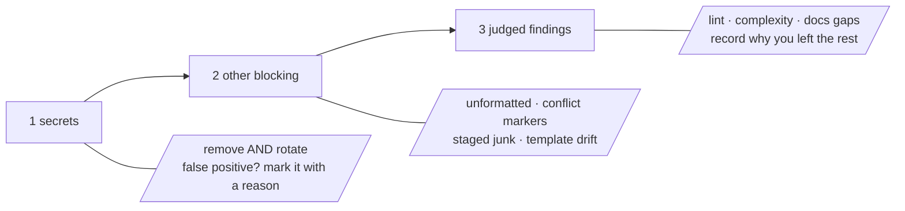

# How to onboard an existing codebase

**A how-to guide.** Goal: take a repository Procoder has never governed
and bring it to a state where the commit gate passes.

Assumes you have Procoder installed. If not, do the
[tutorial](getting-started.md) first.

## 1. Close the tool gaps

```
/procoder:init
```

`doctor` surveys what **this** repository needs — formatters, linters,
scanners, index builders, chosen by the files you actually have — and
`init` prints one install command per gap for your machine's package
managers. Every command is visible before it runs.

A missing tool is never silently skipped. Files it would have checked
are reported **unchecked, and unchecked fails the gate.** Onboarding
with tools missing produces a scorecard full of NOT-checked lines and
wastes the pass.

## 2. Sweep the whole tree

```
/procoder:audit
```

This is every domain's checks over every tracked file, not just the
diff. Read the whole scorecard before changing anything.

## 3. Fix in triage order

Work the scorecard top-down, one theme per commit, gate-clean after
each:



1. **Secrets.** Every one needs removal **and** rotation. Check for a
   false positive first — a pinned SHA, a test fixture — and mark those
   with `gitleaks:allow` or `.gitleaksignore`, with a reason.
2. **Other blocking findings.** Unformatted files (apply the output of
   `procoder format`), conflict markers, staged junk, template drift,
   failing Terraform.
3. **Judged findings.** Lint, complexity, documentation gaps. Fix what
   is real, in priority order, and record a reason for what you leave.

Re-run `procoder audit` after each theme until the scorecard says the
repository would pass the gate.

## 4. Write the repository's rules files

```
procoder templates
```

This prints the default `.procoder/` files — config, documentation
rules, security rules, the review rubric, the GitHub templates. Write
them, then edit them. The repository's copy always wins over the
built-in default.

## 5. Build the index

```
/procoder:index build
```

Two tiers: universal-ctags across everything, SCIP where the language
has an indexer. The agent gets `find`, `refs`, `callers`, `impact`,
`unused`, and `entrypoints` instead of grep, and the write hook keeps
the index current.

## Common pitfalls

- **Do not** run the audit before `init`. A scorecard of NOT-checked
  lines tells you nothing about the codebase.
- **Do not** fix everything in one commit. The triage order exists so a
  reviewer can follow what changed and why; one giant commit hides a
  secret rotation among two hundred formatting diffs.
- **Do not** silence a secret finding without rotating the credential.
  Removing it from the working tree leaves it in the git history and in
  whatever already read it.
- **Do not** treat every info line as work. They are judgment calls;
  record why you left one rather than fixing it to make a number go
  down.

## Next

- [Ship a change](workflow.md) — the daily sequence from here on.
- [Configuration](configuration.md) — every knob in `.procoder/`.
- [The ten domains](domains.md) — what each check covers and what
  blocks.
