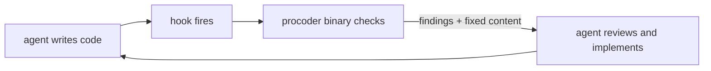

# procoder

**Make your AI coder work like a senior developer** — a commit gate it
cannot talk its way past, quality controllers that refuse to call
unfinished work done, a self-learning loop that closes each escaped
bug's whole class, and one contract that works across every AI coding
agent. The agent stays in control; nothing ever touches your code behind
its back.

Current version: **0.22.0**

## Start here

- **[Getting started](getting-started.md)** — install to governed in ten
  minutes, on Claude Code or any agent.
- **[The quality chain](quality-chain.md)** — spec → plan → todo → gate →
  lessons, and why every link refuses instead of advising.
- **[Every agent](portability.md)** — Cursor, Codex, Copilot, OpenCode,
  Kilo Code and the rest: one `AGENTS.md`, thin adapters, drift-guarded.
- **[Architecture](architecture.md)** — the binary, the hooks, and the
  three contracts (agent in control, unchecked is never clean, the
  repo's files win).

## The reference

- **[The nine domains](domains.md)** — security, lint, maintainability,
  performance, documentation, formatting, CI, infra, GitOps: what each
  checks and what blocks.
- **[Command reference](commands.md)** — every command, from the gate
  to the lessons ledger.
- **[Configuration](configuration.md)** — every knob and rules file
  under `.procoder/`, and the override guarantee.
- **[The workflow](workflow.md)** — worktree-first branching, the PR
  discipline, watch-only merge polling, post-merge cleanup.
- **[Changelog](https://github.com/azrtydxb/procoder/blob/main/CHANGELOG.md)** —
  every release, in words a user can read (also in this site's nav,
  built from the repo's CHANGELOG at deploy time).

## What makes it different

**Refusal, not advice.** `todo close` refuses without evidence;
`spec check` blocks on open questions; the gate counts a tool that
could not run as failing. Verdicts mean something because they cannot
be waved through.

**Honesty as a feature.** NOT-checked never reads as clean, claims
carry their method, and the docs you are reading are themselves held to
completeness checks that block the gate — this site cannot silently go
stale, because that has happened and became a
[lesson](quality-chain.md#lessons-escapes-close-their-class).

**One engine, thin everything else.** A single Go binary computes every
verdict; skills, hooks, and per-agent adapters are pointers to it. No
runtime dependencies, no network at hook time, air-gapped installs
included.
