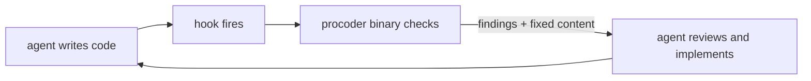

# procoder

**Make your AI coder work like a senior developer** — real formatters, git
discipline, documentation checks and merge gates, delivered as tools the agent
runs itself and hooks it cannot skip. The agent stays in control; nothing ever
touches your code behind its back.



## Quick start

```
/plugin marketplace add azrtydxb/procoder
/plugin install procoder
/procoder:init
```

## What ships today

- **Clean code (domain 6)** — every write checked against the ecosystem's
  canonical formatter; the agent receives the formatted result in-turn and
  writes it itself.
- **GitOps/GitHub (domain 9)** — conflict markers, junk files, oversized
  files, AI-attribution scrubbing, commit and PR templates, actionlint on
  workflows, worktree-first branching, watch-only merge polling, post-merge
  cleanup.
- **Documentation (domain 5)** — broken references and diagrams block; drift,
  API doc comments, badges, README structure and Pages health reported; this
  site is built by the harness's own CI job.

The full story lives in the [README](https://github.com/azrtydxb/procoder#readme)
and the design contract; the harness's nine domains ship level by level.
