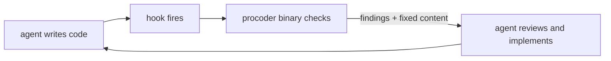

# procoder

**Make your AI coder work like a senior developer** — all nine domains of
senior work, from security scans to merge discipline, delivered as tools the
agent runs itself and hooks it cannot skip. The agent stays in control;
nothing ever touches your code behind its back.

Current version: **0.17.0**



## Quick start

```
/plugin marketplace add azrtydxb/procoder
/plugin install procoder
/procoder:init
```

## The nine domains, all shipped

1. **Security** — gitleaks blocks secrets the moment they land in a file;
   semgrep SAST and osv-scanner dependency checks behind
   `procoder security --deep` and CI.
2. **Best practices** — the canonical linter per ecosystem (golangci-lint,
   ruff, shellcheck, eslint — with a built-in-rules baseline for configless
   JavaScript) in the write hook and the gate.
3. **Maintainability** — dead code from the index, complexity and function
   length; all judgment calls, repo-tunable thresholds.
4. **Performance** — `/procoder:perf`, the measure-first discipline.
5. **Documentation** — broken references and diagrams block; drift, badges,
   version-tracked pages, and this site's own deployment are checked.
6. **Clean code** — every write checked against the ecosystem's canonical
   formatter; the agent receives the formatted result in-turn.
7. **CI/CD/CT** — pinned actions, job timeouts, concurrency cancellation,
   tests-exist; run health via `gh`.
8. **DevOps/IaaS** — hadolint, terraform, kubeconform, helm — each only
   where its files exist.
9. **GitOps/GitHub** — hygiene gates, templates, worktree-first branching,
   watch-only merge polling, post-merge cleanup.

Beneath the domains sits the **code index**: two tiers (universal-ctags +
SCIP), eleven queries from `find` to the call `graph`, consumed by the
agent and the domains alike.

Dig deeper: [the nine domains](domains.md), the
[command reference](commands.md), [configuration](configuration.md), and
[the workflow](workflow.md). Onboarding an existing codebase? Run
`/procoder:audit`.

The full story lives in the [README](https://github.com/azrtydxb/procoder#readme);
the harness's design contract governs everything here.
