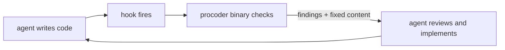

# procoder

**Make your AI coder work like a senior developer** — a commit gate it
cannot talk its way past, quality controllers that refuse to call
unfinished work done, a self-learning loop that closes each escaped
bug's whole class, and one contract that works across every AI coding
agent. The agent stays in control; nothing ever touches your code behind
its back.

Current version: **0.32.4**

## Start here

- **[Getting started](getting-started.md)** — install to governed in ten
  minutes, on Claude Code or any agent.
- **[The quality chain](quality-chain.md)** — spec-based development:
  the design-document interview, the implementation planner, the
  project layer of milestones/epics/stories worked in sprints, the
  evidence-gated todo list, and the quality gates that connect them
  (spec → plan → backlog → gate → lessons).
- **[Every agent](portability.md)** — Cursor, Codex, Copilot, OpenCode,
  Kilo Code and the rest: one `AGENTS.md`, thin adapters, drift-guarded.
- **[Architecture](architecture.md)** — the binary, the hooks, and the
  three contracts (agent in control, unchecked is never clean, the
  repo's files win).
- **[Influences](influences.md)** — the ideas adopted from the
  superpowers and ponytail plugins, and where each lives in procoder.

## The reference

- **[The ten domains](domains.md)** — security, lint, maintainability
  and dependency freshness, performance and benchmarks, documentation
  and decision records, formatting, testing, CI, infra, GitOps: what
  each checks and what blocks.
- **[Command reference](commands.md)** — every command, from the gate
  to the release controller.
- **[Configuration](configuration.md)** — every knob and rules file
  under `.procoder/`, and the override guarantee.
- **[The workflow](workflow.md)** — the daily sequence: spec, plan,
  backlog, sprint, build, test, check, PR, merge, retro, release.
- **[Changelog](https://github.com/azrtydxb/procoder/blob/main/CHANGELOG.md)** —
  every release, in words a user can read (also in this site's nav,
  built from the repo's CHANGELOG at deploy time).

## What makes it different

**Refusal, not advice.** `todo close` refuses without evidence;
`spec check` blocks on open questions; `sprint close` refuses to hide an
unfinished story; `release` lists every reason the tag is not earned
yet; the gate counts a tool that could not run as failing. Verdicts mean
something because they cannot be waved through.

**Honesty as a feature.** NOT-checked never reads as clean, a test suite
that did not run is never green, single-ecosystem checks say which
ecosystem (benchmarks are Go, licenses are Go, complexity is Go and
Python), claims carry their method, and the docs you are reading are
themselves held to completeness checks that block the gate — this site cannot silently go
stale ([how the lessons loop enforces
that](quality-chain.md#lessons-escapes-close-their-class)).

**One engine, thin everything else.** A single Go binary computes every
verdict; skills, hooks, and per-agent adapters are pointers to it. No
runtime dependencies, no network at hook time, air-gapped installs
included.
