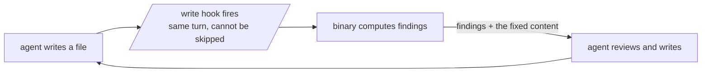

{ .procoder-banner }

**Make your AI coder work like a senior developer** — a commit gate it
cannot talk its way past, quality controllers that refuse to call
unfinished work done, a self-learning loop that closes each escaped
bug's whole class, and one contract that works across every AI coding
agent. The agent stays in control; nothing ever touches your code behind
its back.

Current version: **3.2.0**

This site follows the [Divio documentation
system](https://docs.divio.com/documentation-system/): a tutorial to
learn from, how-to guides to work from, reference to look things up in,
and explanation to understand by. Each page says which it is.

## Learn

- **[Getting started](getting-started.md)** — the tutorial, for Claude
  Code: one-step install, let it fit out your repository, then watch the
  gate refuse a change and accept it. Ten minutes.

## Work

- **[Ship a change](workflow.md)** — the daily sequence: spec, plan,
  backlog, sprint, build, test, check, PR, merge, retro, release.
- **[Onboard an existing codebase](how-to-onboard.md)** — bring a
  repository Procoder has never governed up to a passing gate.
- **[Install without the plugin](how-to-install-manually.md)** — the
  binary on `PATH` for Cursor, Codex, Copilot, or anything reading
  `AGENTS.md`.

## The reference

- **[The ten domains](domains.md)** — security, lint, maintainability
  and dependency freshness, performance and benchmarks, documentation
  and decision records, formatting, testing, CI, infra, GitOps: what
  each checks and what blocks.
- **[Command reference](commands.md)** — every command, from the gate
  to the release controller.
- **[Configuration](configuration.md)** — every knob and rules file
  under `.procoder/`, and the override guarantee.
- **[Every agent](portability.md)** — Cursor, Codex, Copilot, OpenCode,
  Kilo Code and the rest: one `AGENTS.md`, thin adapters, drift-guarded.
- **[Changelog](https://github.com/azrtydxb/procoder/blob/main/CHANGELOG.md)** —
  every release, in words a user can read (also in this site's nav,
  built from the repo's CHANGELOG at deploy time).

## Understand

- **[The quality chain](quality-chain.md)** — why "done" is a verdict a
  controller gives rather than a feeling the agent has, and why every
  link refuses instead of advising.
- **[Architecture](architecture.md)** — the binary, the hooks, and the
  three contracts (agent in control, unchecked is never clean, the
  repo's files win).
- **[Influences](influences.md)** — what Procoder absorbed from
  superpowers, ponytail and serena, where each idea lives now, and why
  you no longer need to run them alongside it.

## What makes it different

**Refusal, not advice.** `todo close` refuses without evidence;
`spec check` blocks on open questions; `sprint close` refuses to hide an
unfinished story; `release` lists every reason the tag is not earned
yet; the gate counts a tool that could not run as failing. Verdicts mean
something because they cannot be waved through.

**Reports that mean what they say.** NOT-checked never reads as clean, a
test suite that did not run is never green, single-ecosystem checks name
their ecosystem (benchmarks are Go, licenses are Go, complexity is Go and
Python), claims carry their method, and the docs you are reading are
held to completeness checks that block the gate ([how the lessons loop
enforces that](quality-chain.md#why-escapes-have-to-close-their-class)).

**One engine, thin everything else.** A single Go binary computes every
verdict; skills, hooks, and per-agent adapters are pointers to it. No
runtime dependencies, no network at hook time, air-gapped installs
included.
