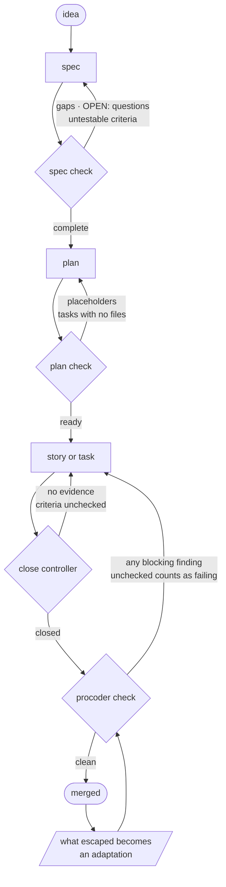

# The quality chain

**An explanation.** Why Procoder makes "done" a verdict something else
gives, rather than a judgment the agent makes about its own work. For
the commands, see the [command reference](commands.md); for the daily
sequence, see [how to ship a change](workflow.md).

## The problem it solves

An AI coding agent is a confident narrator of its own progress. It
reports work as finished because the last thing it did looked like
finishing. Nothing in that loop is adversarial to the agent's own
optimism, so "done" degrades into "I stopped".

Procoder's answer is to move the verdict out of the agent. The agent
writes; a controller in the binary judges. The chain runs
spec → plan → backlog → gate → lessons, and every link refuses to
advance until the work is actually complete.

Each box is a stage; each diamond is a controller that can say no. The
loops back are the point — nothing advances by being asserted done.



The `todo` list runs beside the chain rather than inside it: the
standalone tracker for work not born from a spec, with the same closing
rigor.

## Why the thinking comes first

The spec exists because design gaps are cheapest to close before code
exists, and because an agent asked to build from a vague brief will
invent the missing decisions silently. The interview makes those
decisions explicit and hands them back to the person who should be
making them: anything the user has not decided goes in as an `OPEN:`
line, and the controller refuses while one remains.

`procoder spec check` blocks on missing sections, unresolved questions,
and criteria a reviewer could not verify. It is blunt on purpose:

```
$ procoder spec check payments
spec payments: NOT ready — the quality controller found:
  - section missing: In scope
  - section missing: Out of scope
  - section missing: Constraints
  - section missing: Interfaces
  - section missing: Data
  - section missing: Edge cases
  - section missing: Failure modes
  - 1 unresolved OPEN: question(s) — resolve each with the user and rewrite it as a decision
  - untestable criterion: the UI is user-friendly — say what a reviewer would observe, not how it should feel
```

A spec that survives that is a real design document: a different
engineer could build the feature from it without asking its author
anything.

The plan is the same idea one level down. It is written for an engineer
with zero context, because that is what a fresh agent context is. Each
task carries its files, the exact interfaces its neighbours expose, and
test-first steps — and `plan check` blocks the phrases that mean nothing
was decided: "TBD", "handle edge cases", "similar to Task N".

## Why the project layer is separate

Larger work needs a shape that a task list cannot hold, so the backlog
adds milestones, epics, and user stories. Seeding an epic from a spec
records the spec's fingerprint, which is what lets the board flag drift
when the spec changes afterwards — a story quietly built against an
older design is a defect nobody sees until review.

The story is the execution unit and carries the same rigor as a
standalone task. Closes cascade upward: an epic cannot close while a
story is open, a milestone cannot close while an epic is.

Sprints are scope-boxed rather than estimated. One is active at a time,
and closing one refuses while a committed story is neither done nor
explicitly carried back with a reason. Unfinished work stays visible.
There are no story points and no burndown: stories are counted and the
goal is the commitment, because a velocity number is something to farm
and a goal is something to meet.

The retro is the price of the next sprint, not a ritual — `sprint open`
refuses while the last sprint's retro is empty.

## Why evidence, not assertion

A task closes on evidence: what was run, and what the run proved. Fresh
runs only. For a regression test, the red-green proof. A subagent's
"done" is a claim until it is verified in the diff.

`procoder todo close` refuses until every criterion is checked, the
evidence records what it proved, and the commit gate itself is clean —
the binary runs the real gate as the final criterion, so a task cannot
close on a broken tree. Under `[test] policy = "block"` the suite joins
that verdict, and a suite that **cannot be verified** blocks exactly
like a failing one.

That last equivalence is the important one. Unverifiable and failing are
the same answer, because treating "I could not check" as "it is fine" is
how every silent regression ships.

## Why one gate

`procoder check` is the same collection CI runs and `procoder git`
prints. One code path, so the three can never disagree and no argument
about "it passes locally" is possible. Unchecked counts as failing.
There is no side door.

## Why escapes have to close their class

Before a PR exists, the pre-PR self-review reads the diff with fresh
context against `.procoder/github/REVIEW.md`. Anything that still
escapes to a downstream reviewer triggers the reflection step: name the
layer that should have caught it, adapt that layer in the same PR, and
record it.

`procoder lessons` flags any entry with no adaptation as UNLEARNED and
exits 1, because recorded is not learned. A lesson without an adaptation
is a diary entry. The rubric grows from real escapes, so the same class
cannot escape twice.

## Why refusal, not advice

Every controller answers with a refusal that names the gap, never a
warning that can be waved through.

Advice gets rationalised under pressure — and an agent under pressure to
finish is the normal case, not the edge case. A named, blocking gap gets
fixed because there is no other way forward. That is the whole
difference between a checklist and a gate, and it is why the chain's
verdicts mean something when you read them in a log: "COMPLETE" was
earned against something that was trying not to say it.

## The cost

Refusal is expensive when the controller is wrong. A criterion that is
badly worded, a section the template demands but the work does not need,
a gate finding that is a false positive — each costs real time, and the
tempting fix is to weaken the criterion until it passes.

That is the failure mode to watch for. The rule is to fix what the
refusal names or change the rule deliberately in `.procoder/`, never to
soften the wording until the controller stops objecting. The
repository's rules are yours to edit precisely so that disagreeing with
a default is a decision you record rather than one you smuggle.
