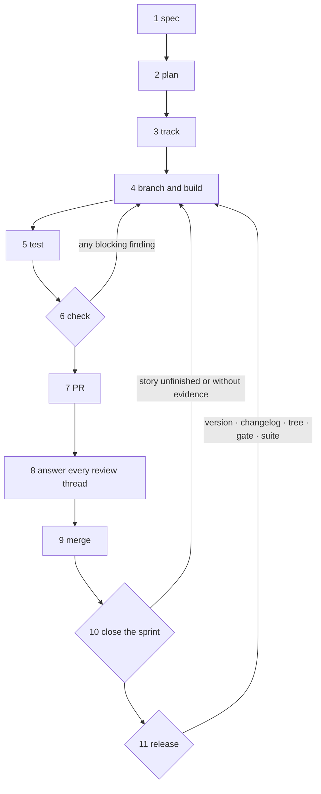

# How to ship a change

**A how-to guide.** Goal: take a change from idea to tagged release. The
skills drive each step; the team rules live in
`.procoder/github/WORKFLOW.md` and are yours to edit.

Assumes Procoder is installed and the repository is onboarded. New here?
Start with the [tutorial](getting-started.md).



Dotted arrows are refusals: the step that sends you back, and what it
checks before it does.

## 1. Write the spec

```
/procoder:spec <feature>
```

The skill classifies the work first and says which path it took. Small,
bounded changes to a flow that already exists skip the spec file
entirely.

The skill runs the controller for you, and it blocks while a section is
empty, a question in Open questions is unanswered (answer it with
`procoder ask`, or rewrite it as a decision), or an acceptance criterion is
untestable.

## 2. Write the plan

```
/procoder:plan <feature>
```

Turns a COMPLETE spec into `.procoder/plans/<feature>.md`: Goal,
Architecture, Constraints verbatim, and `## Task N:` blocks carrying
files, interfaces, and test-first steps.

Its controller blocks placeholders and tasks with no files or steps.

## 3. Track the work

For a project with a shape worth planning:

```
/procoder:backlog seed .procoder/specs/<feature>.md
/procoder:sprint open "<goal>"
/procoder:sprint pull <story-id>
```

`seed` makes an epic and one story per acceptance criterion. One sprint
is active at a time.

For standalone work not born from a spec:

```
/procoder:todo add "<task>"
```

Same closing rigor, no project layer.

## 4. Branch and build

```
git worktree add ../<feature> -b <feature>
```

A worktree per feature is what `.procoder/github/WORKFLOW.md`
prescribes. It is plain git — Procoder creates and removes nothing.

While you write, the write hook (PostToolUse) checks each file in the
same turn and hands back the formatted result plus the domain findings.
Use the index instead of grep:

```
/procoder:index find <symbol>
/procoder:index refs <symbol>
/procoder:index impact <file>
```

## 5. Run the suite

```
/procoder:test
```

Each detected ecosystem's canonical runner. **NOT run is never green.**
With `[test] policy = "block"` in `.procoder/config.toml`, the suite
joins the close controllers.

For a performance claim:

```
/procoder:perf
```

Compares against the saved baseline. Go only.

## 6. Clear the gate

```
/procoder:check
```

Formatting, hygiene, lint, secrets, docs, CI and infra rules — the same
code path CI runs. Must be clean before a PR exists.

## 7. Open the PR

```
/procoder:pr
```

The skill first checks the issue for a pull request somebody else already
opened, and defers to theirs rather than opening a second one. Then it
summarises the real diff, fills the template from
`.procoder/github/`, scrubs attribution, verifies the blast radius with
`procoder index impact`, and shows you everything before `gh pr create`.

Before any of that it dispatches a fresh-context reviewer over the diff
with two lenses: the correctness rubric in `.procoder/github/REVIEW.md`,
and the five simplification tags — what should not exist. Critical and
Important findings are fixed, and cuts decided, before the PR opens.

Keep the title at 72 characters or fewer — it becomes the squash-commit
subject.

## 8. Answer every review thread

Every thread — human or bot, Copilot included — is either fixed (commit,
push, reply saying what changed) or answered with a concrete reason.
Resolve a thread only after that, never to clear the list.

## 9. Merge and clean up

```
/procoder:merge
```

Squash-merge when every check is green and every thread is answered,
then delete the remote branch, delete the local branch, remove the
worktree, and `git fetch --prune`.

Anything that escaped to a reviewer becomes a
`.procoder/github/LESSONS.md` entry with the adaptation that closes its
class — in the same PR.

What GitHub Copilot's auto-review found is collected the same way:

```
procoder copilot-leak
```

Findings are sanitised before anything is shown or sent, nothing is
published without an explicit yes, and each captured finding lands in
`.procoder/github/COPILOT-LEAKS.md` as unlearned until someone writes
its adaptation. `procoder copilot-leak --from-copilot` reads that ledger
back and exits 1 while any finding is unclassified.

## 10. Close the sprint

```
/procoder:backlog close story <id>
/procoder:sprint close
```

The story close refuses without checked criteria, recorded evidence, and
a clean gate. The sprint close refuses while a committed story is
neither done nor carried back with a reason, then scaffolds the retro.
That retro is the price of the next `sprint open`.

## 10b. Answer what procoder cannot

```
procoder ask
```

Some findings are requests for judgement rather than defects. `ask` collects
them, puts them to you, and records what you said so the next session starts
from your decision. Without a terminal it writes the questions to
`.procoder/ask/QA.md` and the agent relays them — it must not answer them
itself, because an invented answer is indistinguishable from a decision once
it is written down.

## 11. Release

```
/procoder:release <version>
```

Verifies the version across `[release] files`, the changelog entry, a
clean tree, the gate, and the suite — every failure listed at once. On
success it prints the `git tag` command for you to run.

The release flow also runs the simplification sweep over the whole
repository: a tag ships the accumulated shape of the code, not just the
last change.

**It tags nothing itself.**

## Common pitfalls

- **Do not** skip `procoder check` because the write hook was quiet. The
  hook sees one file at a time; the gate sees the whole changed set,
  including staged junk and conflict markers in files you never opened.
- **Do not** weaken an acceptance criterion to make a close controller
  pass. The refusal names a real gap; softening the criterion hides it.
- **Do not** resolve a review thread to tidy the list. Resolve it because
  it is answered.
- **Do not** treat a green write hook as a green suite. Formatting and
  tests are different questions.

## Next

- [The quality chain](quality-chain.md) — why each controller refuses
  rather than warns.
- [Command reference](commands.md) — every command and its flags.
- [The ten domains](domains.md) — what each check covers.
